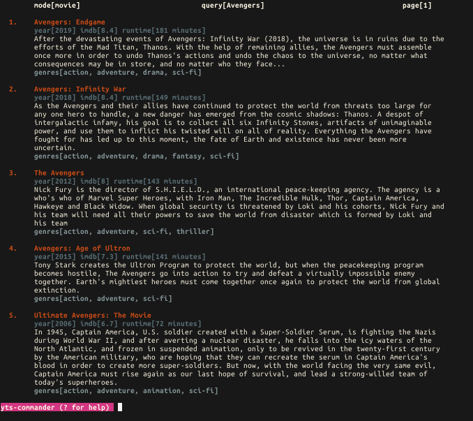
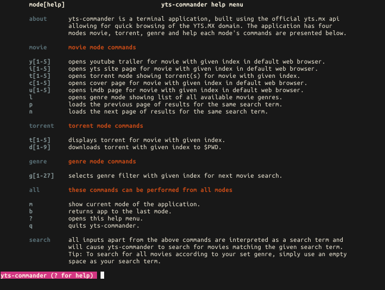

# yts-commander &middot; [](https://github.com/atifcppprogrammer/yts-commander/blob/master/LICENSE) [](https://www.npmjs.com/package/yts-commander)
A terminal client for YTS.MX.

## Features
- Quickly search and browse through movies available on YTS.MX
- Filter movie search one of 27 different genres.
- View and download available movie torrents to current working directory.
- Open youtube trailer, imdb or yts page for corresponding movie in default web browser.

## Installation
```bash
npm -g install yts-commander
```
## Flags
```bash
Usage: yts-commander [options]

Options:
  -d, --disable  disable application colors
  -V, --version  output the version number
  -h, --help     display help for command

The above help pertains only to the flags with which yts-commander can be
invoked for more detailed information regarding how to use this cli we
recommened that you launch yts-commander and enter '?' to obtain a more
detailed help menu. Have fun using yts-commander !
```  
## Modes and Usage
**yts-commander** has four modes namely **movie**, **torrent**, **genre** and **help**, each of these 
modes has its own set of commands and role in the application. We discuss each of these modes below.

### Movie
When launched **yts-commander** will start in this mode **expecting** the user to provide a search term,
once entered the application will fetch the corresponding movies and show the first page of the fetched
results. The screenshot
below shows the results yielded by entering *avengers*.
<p align = "center">
  <kbd>  </kbd>
</p>
The user can then use *p* - (load previous page) and *n* - (load next page) commands for paging through
the fetched results. Each page of results shows no more than **five** movies. for which the commands
*c[1-5]*, *y[1-5]*, *i[1-5]* and *u[1-5]* open the movie cover photo, youtube trailer, imdb papge and 
yts site page respectively in the user's default web browser.

### Torrent
The **torrent** mode is activated when the user invokes the *t[1-5]* command in **movie** mode on any one 
of the movies being show on the current page. The screenshot below shows torrent mode being activated as 
a result of entering *t1* in the movie mode whose screenshot was presented above.
<p align = "center">
  <kbd>  </kbd>
</p>
The command *t[1-5]* can also be invoked in this mode to navigate to torrents of the other movies being
shown on the present page in **movie** mode, to return back to the current page of results (from where 
the **torrent** mode was invoked) one simply has to use the *b* command.

### Genre
The **genre** mode is activated when the user invokes the *l* command in **movie** mode. Once open
the user can select a movie genre using the *g[1-27]* command. This selection is then saved and only 
comes into effect when the user perfoms a new search, like in **torrent** mode the command *b* returns
**yts-commander** to the current page in **movie** mode.
<p align = "center">
  <kbd>  </kbd>
</p>

### Help
The command *?* invokes the help mode, this mode merely summarizes the commands and modes which we have 
discussed above. In addition to these there are certain commands which may be invoked regardless of which
mode **yts-commander** is presently in.
<p align = "center">
  <kbd>  </kbd>
</p>
Unlike the **torrent** and **genre** modes the help mode can be invoked from any other mode. The use of 
the *b* command in this mode returns the **yts-commander** to which ever mode the *?* command was initiated
from.

## Searching and Navigation
We must remark here that searching can also be carried out from any mode. The search if successful will
return **yts-commander** back to **movie** mode and all results yielded by the last search will be lost.


